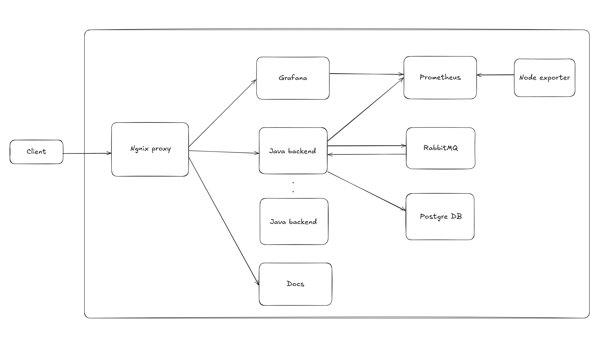

# Architecture

FridgeBridge architecture can be summarized by the following diagram:

## Workflow

1. The Client makes a request to the system.
2. The request is routed through the Nginx proxy, which forwards it to the appropriate Java backend service.
3. The Java backend processes the request, interacts with the PostgreSQL database, and communicates with RabbitMQ for message handling.
4. Metrics and performance data from the Java backend are collected by Prometheus and visualized using Grafana.

## Components

1. [**Nginx Proxy**:](https://nginx.org/en/) Acts as the entry point for client requests. Routes traffic to the appropriate Java backend services load balancing and reverse proxying for scalability and reliability. It also has routes to serve `documentation` and the `grafana` dashboard.

2. **Java Backend**:
   The core business logic of the application resides here. It has 4 main processes:

- The API written with [Javalin](https://javalin.io/documentation).
- Reporter: runs in the background and create periodic various reports of interest.
- Metrics: it exposes a metrics endpoint for prometheus to scrap.

3.  [**RabbitMQ**](https://www.rabbitmq.com/):
    A message broker for asynchronous communication. The Java backend uses RabbitMQ to manage tasks and message queues to synchronize the instances and handle the fridges sensors updates.

4.  [**Prometheus**](https://prometheus.io/): Collects metrics and data from the Java backend. It also scraps data from [node_exporter](https://github.com/prometheus/node_exporter) a service we have running to collect metrics about the server usage (RAM, CPU, DISK, Network, etc).

5.  [**Grafana**](https://grafana.com/): A data visualizer that supports prometheus as a data source. It queries prometheus for the data and shows it in different formats that allow us to get insights into the system performance and reliability.

6.  **Docs**: Servers the static files for the documentation. Site was built using [Docusaurus](https://docusaurus.io/).

## Deployment

The deployments are automated with [Ansible](https://www.ansible.com/). On prod, all the services run under [systemd](https://en.wikipedia.org/wiki/Systemd). For local development, [Docker](https://www.docker.com/) is used to simplify dependency management and the installation of all the tools.

We manage our DNS with [freedns](https://freedns.afraid.org/) and SSL certificates are generated with [LetsEncrypt](https://letsencrypt.org/). Finally, we are currently using [Azure](https://azure.microsoft.com/en-us/) as our cloud provider.
